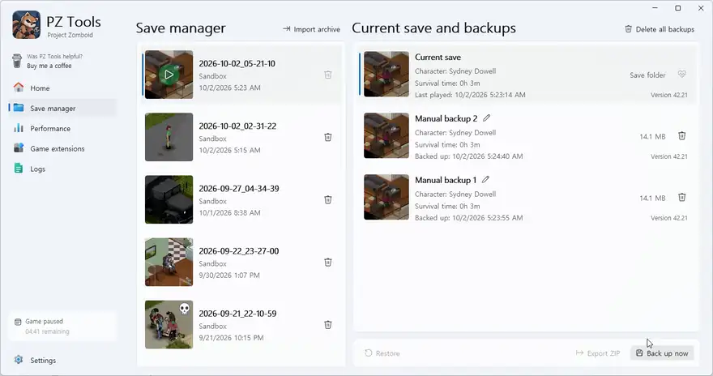
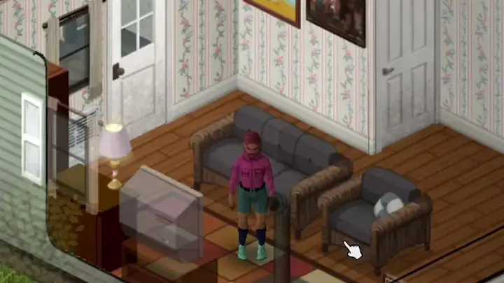
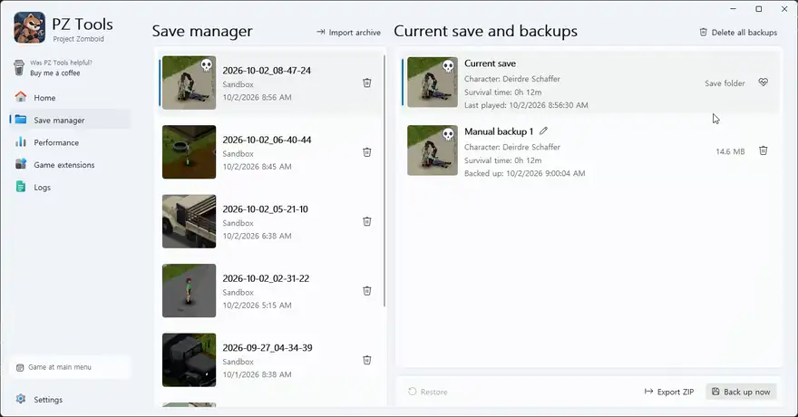
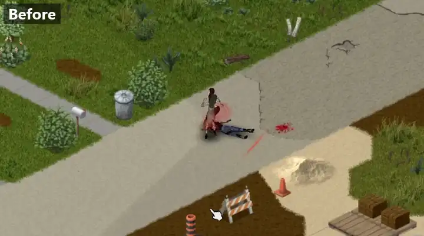
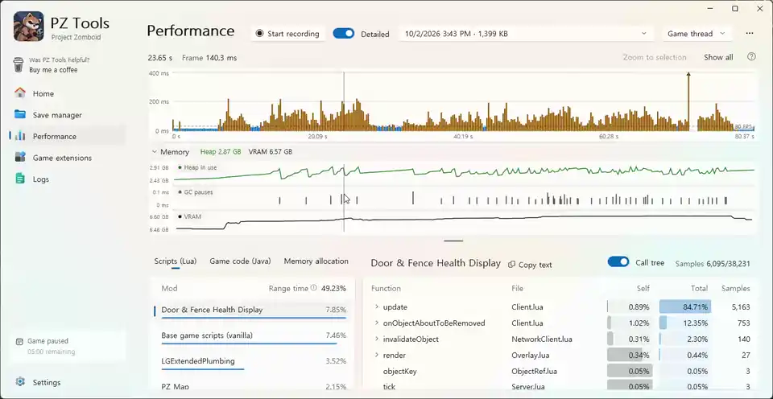
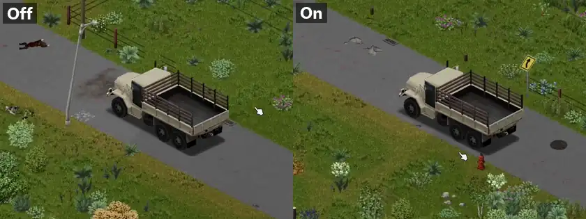
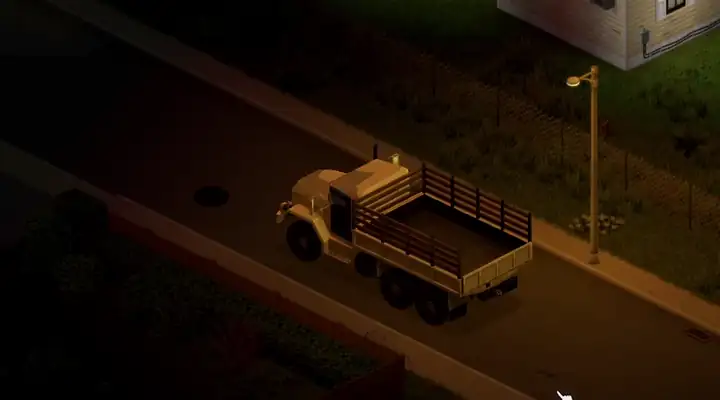

# PZ Tools

Incremental backups, character recovery, performance recording and game extensions for Project Zomboid on Windows.

Create backups, browse save history, heal or revive characters in supported saves, find which mods slow the game down, and turn on vehicle driving improvements without installing a mod. PZ Tools is unofficial and is not affiliated with The Indie Stone.



<a id="features"></a>
## Features

- **Automatic and manual backups** with thumbnails, character details and editable names.
- **Incremental storage** with compression, NTFS change tracking and file-content comparisons when change tracking is unavailable.
- **Automatic backup timing** that follows the active save and can pause the countdown while the game is paused or your character is asleep.
- **Save before backup**, with an optional in-game countdown and completion notice.
- **ZIP import/export** and offline character healing, revival and inventory recovery.
- **Performance recording** of the running game, showing frame times and the script time of each mod.
- **Game memory** for Project Zomboid set from Settings, without editing its launcher file by hand.
- **Hotkeys** that work inside the game: save the last minutes, record, back up, and more.
- **Optional vehicle controls** for acceleration, shifting, reversing and keyboard steering, plus a light around the vehicle while its headlights are on. The extension starts off; each of its four options can be switched separately.

The Home page shows whether the game is running, the latest save's last backup and the vehicle extension's state. Includes 18 interface languages, themes, tray mode, progress cards and filtered logs. Documentation is English-only.

<a id="getting-started"></a>
## Get started

Requires **Windows x64** and the **[.NET 10 runtime](https://dotnet.microsoft.com/en-us/download/dotnet/10.0)**. The app requests administrator permission for NTFS change tracking.
WinUI components and the Java Attach runtime are included; no separate Java installation is needed.

1. Get a runnable package from [Releases](https://github.com/isxcsm/pz-tools/releases), or build from source below. Extract the whole package and run `PzTools.App.exe`; GitHub's source ZIP is not a runnable app. Any folder works, including one with non-English letters in its path; up to 0.2.1 the app could not connect to the game from such a folder, which is fixed (two small files are then copied to a folder of yours, see [files and folders](docs/reference/files-and-folders.md)).
2. Open Settings in the sidebar and check the save and backup folders. The app starts in your Windows display language, or in English if it does not have that one. Keep those folders separate.
3. Create a manual backup and confirm it completes. Automatic backups default to **every 5 minutes**, keeping **20 automatic backups**.

About once an hour while it runs, the app asks GitHub whether a newer release is out (one request to `api.github.com`; nothing else is sent and nothing is downloaded by itself). A new version shows as one line in the sidebar until you update; clicking it opens the release page. *Settings → Version* shows your version, checks on demand, and turns the notice (and the check) off.

To update, close the app and extract the new package: from 0.2.2 its folder is named for its version (`PzTools-v0.2.2`), so it goes beside the old one, which you can then delete. Do not mix builds; if a package was extracted over another, the app finds the files that differ and asks for a clean copy. Your settings live under `%LOCALAPPDATA%\PzTools`; saves and backups stay in their configured folders, and a newer version keeps using them: a backup folder is brought up to date in place the first time the new version opens it. See [settings and paths](docs/reference/settings.md).

Updating from 0.1.0: the first time 0.2.0 opens a backup folder, it upgrades the folder's catalog in place (all or nothing; nothing is lost). **After that, 0.1.0 can no longer open that folder**, so do not go back to 0.1.0 with it. The vehicle extension's new *Light around the vehicle* option starts on, so if the extension was on, the light comes on with headlights. Switch it off on the Game extensions page if you do not want it.

Updating from 0.2.0 or 0.2.1: backup folders are unchanged. If the game is running, the app asks you to restart the game once before it can save it, record it or run its extensions. Automatic backups wait for that restart, as a backup without the game's save may not be whole; a backup you start yourself still runs. A game started after the update needs nothing, so update with the game closed if you can.

<a id="backups-and-retention"></a>
## Backup history

The automatic backup limit does not remove manual backups. Manual backups can still be deleted directly or by cleanup after the original save folder disappears. **Deleting a save through the app also deletes its backups.** Export anything you want to keep before removing or moving a save. See [cleanup policy](docs/design/repository-housekeeping.md).

Automatic timing follows the active save. Pause-aware timing is on by default, preserving the remaining interval while paused or asleep. Restarting the app starts a fresh interval; it does not immediately run an overdue periodic backup.

When your character dies, periodic backups stop until you play a new character, so a game left running on the death screen cannot push the backups made while alive out of the retained history. The optional death backup keeps one backup of that moment.

<a id="game-saving"></a>
## Save before backup

The optional game bridge asks the game to save before reading its files. No Workshop mod or game installation edits are needed. It uses a runtime hook to run the game's normal save operation, which can briefly pause gameplay. The integration targets the inspected Build 42 / Java 25 single-player game.



*Before an automatic backup, a countdown above your character says when the game will save.*

If PZ Tools cannot connect to the running game (for example after a game update), backups continue at the set interval with the files already on disk, and the app says so; features that need the game are locked until the connection returns.

Game saving and in-game notices have separate switches. **Game-save completion is not backup completion**: file copying and compression happen afterward. Turning saving off backs up only data already written to disk. Game-state monitoring and vehicle controls can remain active. See [game integration and compatibility](docs/design/game-bridge.md).

<a id="restore-and-archives"></a>
## Restore and ZIP files

Stop playing the selected save before restoring. **Restore replaces current files and loses progress made after the chosen backup.** If interrupted, reopen PZ Tools and check its status before loading the save.

Export a current save or backup to ZIP for an independent copy, or import one into the save list. Keep important exports on another drive: a backup beside the original does not protect against drive failure.

<a id="character-recovery"></a>
## Character recovery

Recovery works on the current save while it is not being played. It can heal or revive a supported character while preserving positive and negative traits, skills and progress. When death emptied the inventory, it can recover belongings from an identifiable zombie or corpse; missing items are not generated.





*The confirmation shows which zombie or corpse the belongings come from, and what happens to it. Reviving without them is always an option.*

**Create a backup first.** Recovery does not make an extra copy automatically. See [supported formats and recovery limits](docs/design/character-recovery.md).

<a id="performance-recording"></a>
## Performance recording

The Performance page records the running game while you reproduce a lag, then shows a zoomable frame-time graph with 60 and 30 FPS lines. Drag a range (or click one frame) to see where the time went, grouped by base game, each mod and the Java runtime, with the number of samples behind every figure; a bar above the results splits it into scripts, game code, memory pauses and waiting. Each mod's functions open as a call tree (from the event handler down to what it called) or as a plain list. Under the graph, a memory panel shows the Java heap, garbage collections and the game's video memory on the same time axis, and the *Memory allocation* tab ranks mods by the memory their scripts allocate, which is what makes collections frequent. A function in the list opens into the lines it spent its time on, and a search box narrows the table. Two recordings can be compared, say from before and after adding a mod: each mod's and function's share of the time is shown with how much it rose or fell. *Save selection* keeps just a selected range as a recording of its own, to compare against or to send. To measure loading, start a recording at the main menu, then load a save or reload the mods. For a stutter that is over before you could start recording, *Keep the last minutes* in the settings has the game hold its last 1 to 10 minutes, and *Save last minutes* (or Ctrl+Shift+F9 in the game) turns them into a recording right after the stutter. Nothing is measured unless a recording, or keeping the last minutes, is on. Standard mode has almost no effect on the game; Detailed mode samples more often and also records waits and pauses. When the game ran short of memory during a recording, the page says so and leads to the game memory setting.



Each recording is a single file that can be sent to someone else; it holds mod and script names, not your user folder paths. The *Copy text* button beside a result puts what the page shows on the clipboard as text, to paste into a message to a mod's author. See [performance recording](docs/design/profiler.md).

<a id="hotkeys"></a>
## Hotkeys

Under *Settings → Hotkeys*, keys can be set that work while the game has the keyboard: save the last minutes, start or stop a recording, switch the recording mode, turn keeping the last minutes on or off, back up the save being played, turn automatic backups on or off (as the settings' switch does: nothing turns them back on by itself) and show the status. Each answers with a sound and a short note over your character's head. Only *Save last minutes* has a key at first, Ctrl+Shift+F9. See [hotkeys](docs/design/profiler.md#hotkeys).

<a id="game-memory"></a>
## Game memory

Project Zomboid gets 3 GB of memory by default, which a game with many mods fills, and then stutters while memory is freed. *Settings → Game → Game memory* sets more, up to half of your PC's memory, with a size suggested for it. The app changes only the memory options in the game's own launcher file (`ProjectZomboid64.json` in the game folder), keeps a copy of the file as the game shipped it, and the change applies from the game's next start. A game update or Steam's file check puts the game's own size back; the app notices and offers to apply yours again. See [game memory](docs/design/game-memory.md).

<a id="vehicle-controls"></a>
## Vehicle controls

The optional vehicle extension changes how vehicles drive while the game runs, without a Workshop mod: acceleration, shifting, reversing, keyboard steering and a light around the vehicle while its headlights are on. It starts off, and each option can be switched separately on the Game extensions page. See [game extensions](docs/design/game-extensions.md).



*Keyboard steering with the extension off (left) and on (right).*



*The light around the vehicle follows its headlights.*

<a id="backup-engine"></a>
<a id="compatibility-and-safeguards"></a>
<a id="compatibility-and-limits"></a>
## Compatibility and limits

Keep an independent copy of important saves. File verification helps detect changes during capture, but it is not an atomic snapshot of the entire world.

If a backup folder uses an unsupported storage format, PZ Tools leaves it unchanged and refuses to open it. Choose a new empty backup folder and retain the old one if needed; do not delete the game save or just `repository.db`. See [storage compatibility](docs/design/repository-format.md) and [game-extension compatibility](docs/design/game-extensions.md).

<a id="troubleshooting"></a>
## Troubleshooting

Check Logs before retrying a failed operation. If automatic backups are not running, check that they are enabled (the *Automatic backups on/off* hotkey switches them off until switched on again), that a save is being played, and whether the game is paused or the character is asleep. After an app update with the game running, they wait for one game restart; the line in the sidebar says *Automatic backups after a game restart*. Closing to the tray leaves the app running.

PZ Tools is not code-signed; [security](SECURITY.md) says what it does to the game, what goes over the network, and how to check a download. Windows Smart App Control judges each executable separately from cloud reputation and can block some PZ Tools components even when the app itself starts; that verdict can change from day to day. The app reports blocked components in a card with a shortcut to the Smart App Control page in Windows Security (App & browser control). Recent Windows 11 updates let you turn Smart App Control off and back on there; whether to do so is your decision. A blocked component does not stop later automatic backups from being attempted.

If PZ Tools closes because of an unexpected error, it names an error report under `%LOCALAPPDATA%\PzTools\crash`; the newest 20 are kept. Starting PZ Tools while it is already running, including when it is hidden in the tray, brings its window forward.

For an [issue report](https://github.com/isxcsm/pz-tools/issues), include the app and game versions, reproduction steps, relevant logs and any error report. Remove private paths and personal data.

<a id="building"></a>
## Build from source

Use Windows, the .NET SDK selected by `global.json`, PowerShell 7, a Java 25 JDK and Visual Studio C++/WinUI build tools:

```powershell
$jdk = 'C:\path\to\jdk-25'
dotnet build PzTools.sln -c Release -p:Platform=x64 -p:JdkPath="$jdk"
dotnet test tests/PzTools.Backup.Tests -c Release -p:JdkPath="$jdk"
pwsh scripts/publish-app.ps1 -JdkPath $jdk -Output artifacts/app-local
```

Publish to a new or empty folder and distribute the whole output. See [development and validation](docs/contributing/development.md) for prerequisites and integration tests.

<a id="technical-documentation"></a>
## Documentation

The [documentation index](docs/README.md) covers configuration, storage, game integration and development. To understand how the parts fit together, start with the [overview](docs/design/overview.md); unfamiliar terms are explained in the [glossary](docs/design/glossary.md). Dated test results and implementation notes are kept apart in `docs/history`.

<a id="license"></a>
## License

PZ Tools is released under the [MIT License](LICENSE). Bundled and adapted third-party components keep their own licenses; see the [third-party notices](THIRD_PARTY_NOTICES.md). Project Zomboid is a trademark of The Indie Stone; no game code or assets are included.
