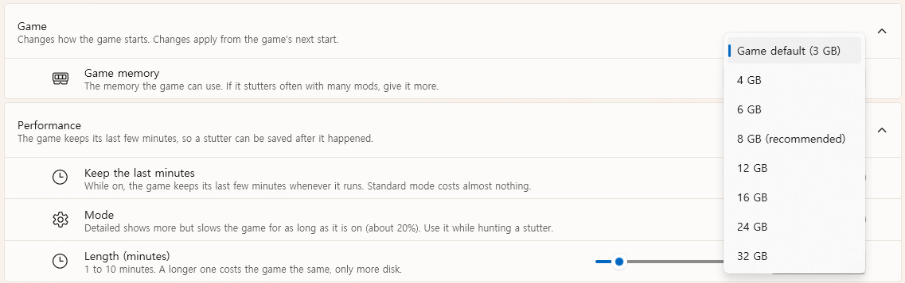
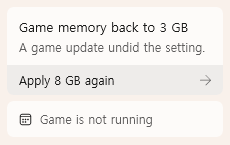

# Give the game more memory

The game starts with 3 GB of memory. With a lot of mods that runs out, and the game keeps
stopping for a moment to free some. If it stutters often, or the **Performance** page says it
ran short, give it more.

## 1. Pick a size

Open **Settings → Game → Game memory** and pick a size. The one marked **(recommended)** is
plenty for a heavy mod list. A PC with less than 16 GB gets no recommendation. The list only goes up to half of your PC's memory, so Windows and
your other programs keep enough.

PZ Tools writes the size into the game's `ProjectZomboid64.json`. It keeps a copy of the
original the first time.

## 2. Restart the game

The new size applies the next time the game starts. If the game is running, quit and start it
again. While it runs, the size it started with is marked **· running** in the list.

## After a game update

A game update, or Steam's file check, puts the game back to 3 GB. PZ Tools notices and shows
**Game memory back to 3 GB** in the sidebar. Press **Apply 8 GB again** (with your size), then
restart the game.

## Going back

Pick **Game default (3 GB)** in the same list.

## If the size doesn't change

| You see or do | Why | What to do |
| --- | --- | --- |
| You start the game with a `.bat` file | The script sets its own memory | Start the game from Steam instead |
| `-Xmx` in the game's Steam launch options | Steam's option wins over the file | Remove it from the launch options |
| **The game's folder was not found. Start the game once and it will be.** | PZ Tools doesn't know where the game is yet | Start the game once, then open the setting again |
| **The game's folder cannot be written to, so nothing was changed.** | Windows refused the write | Check that the game folder isn't read-only |
| **The game's settings file is not as expected, so it was left alone.** | Something else changed the file | Use Steam's file check to restore it, then pick the size again |
