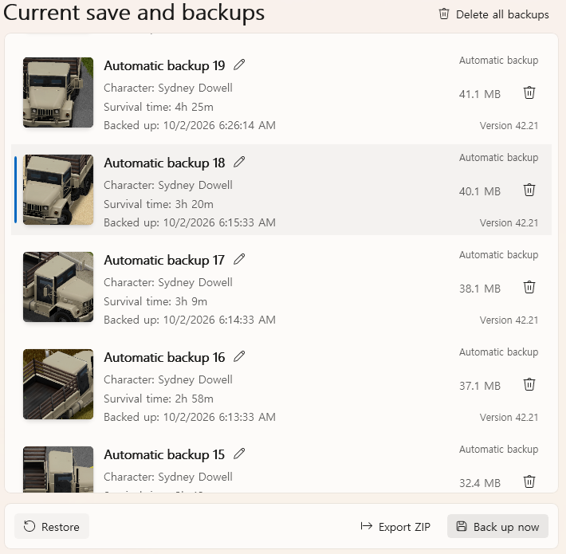

# Go back to an earlier backup

Project Zomboid can be unfair. A crash or a power cut breaks a save you've played for weeks,
a bug kills your character, or a mod update wrecks the world. When that happens, put the save
back the way it was in an earlier backup.

## 1. Leave the save

Quit to the main menu, or close the game. You can't restore the save you're playing.

## 2. Keep what you have now

Restoring replaces the save. Everything after the backup you pick is lost, and PZ Tools doesn't
keep a copy of the current state for you. If you might want it back, press **Back up now**
first.

## 3. Pick the backup

Open **Save manager** and select your save. The list on the right starts with **Current save**,
then the backups, newest first. Each one shows when it was made, the character and their
survival time. A skull means the character was dead in that backup.

Select the backup and press **Restore**. The dialog names the save and the backup. Press
**Restore** again to go ahead.

Load the save in the game, and you're back where that backup was.

## Your backups

- **Automatic backup** is the tag on the ones PZ Tools makes while you play. PZ Tools keeps
  the 20 newest and deletes older ones. Change the number in **Settings → Backup → Automatic
  backups to keep**.
- **Back up now** makes a manual backup. The limit above never deletes those.
- The pencil button renames a backup. A clear name helps you find it later, like "Before the
  mall".
- The bin button deletes one backup, and **Delete all backups** deletes every backup of the
  save. The save itself stays.
- Restoring doesn't remove newer backups, so you can still change your mind and restore one
  of them.

## If it doesn't work

| Message | What to do |
| --- | --- |
| **Backups cannot be restored while playing. Stop playing and try again.** | Quit to the main menu or close the game |
| **The game or other work is using the file. Try again in a moment.** | Wait for the running backup or other work to finish |
| **This backup is damaged. Choose another backup. The save is unchanged.** | Pick another backup |

If restoring stops halfway, for example because the PC shuts down, open PZ Tools again before
you load the save. It finishes or undoes the restore first.
