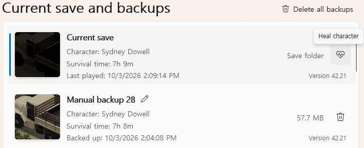

# Bring back a dead character

Killed by a bug, a glitch or an attack through a wall? PZ Tools can heal your character, or bring
them back from the dead, with their traits, skills and everything they learned. If you choose,
they also get back what their zombie or corpse is carrying.

## 1. Leave the save

Quit to the main menu or close the game. The save can't be changed while you're playing it.

Don't start a new character in that world. A new character takes the dead one's place in the
save, and then there is nobody left to revive.

## 2. Back up first

Open **Save manager**, select the save and press **Back up now**. Reviving changes the save
directly and has no undo. With a backup you can go back to the moment of death.

## 3. Heal

The **Current save** row at the top of the list has a heart button, **Heal character**. Press
it.

If the character is dead, PZ Tools looks for their zombie or corpse. Choose where to take the
belongings back from:

- **Take N items back from the zombie** or **from the corpse**. That zombie or corpse
  disappears from the world.
- **Revive without belongings**. The zombie or corpse stays where it is, still carrying them.

If the save has several characters, choose the one to bring back first. The others aren't
changed.

Press **Heal character**. The sidebar says **Character revived** and how many items came back.

## 4. Play

Load the save. Your character is standing where they died, healthy, with their traits and
skills.

## What it does and doesn't do

- Health comes back in full. Wounds, infection, bandages and splints are gone.
- Traits, skills, XP, recipes, weight and position stay as they were.
- Items come back only from the character's own zombie or corpse. Anything already looted or
  destroyed is gone.
- Effects added by mods may stay.

## If it doesn't work

| Message | What to do |
| --- | --- |
| **Cannot heal while playing. Quit to the main menu.** | Quit to the main menu or close the game |
| **The game did not close this save properly. Load it in the game and quit normally.** | Load the save, then quit to the main menu |
| **The game or other work is using this save.** | Wait for the running backup or other work to finish |
| **Only single-player saves can be healed.** | Multiplayer saves can't be changed |
| **This save has several characters. Choose one and try again.** | Press **Heal character** again and choose the character |

None of these change the save.

If you already started a new character, go back to a backup from before that. Restoring it
brings back the save as it was then, dead character included, and you can revive them from
there.
